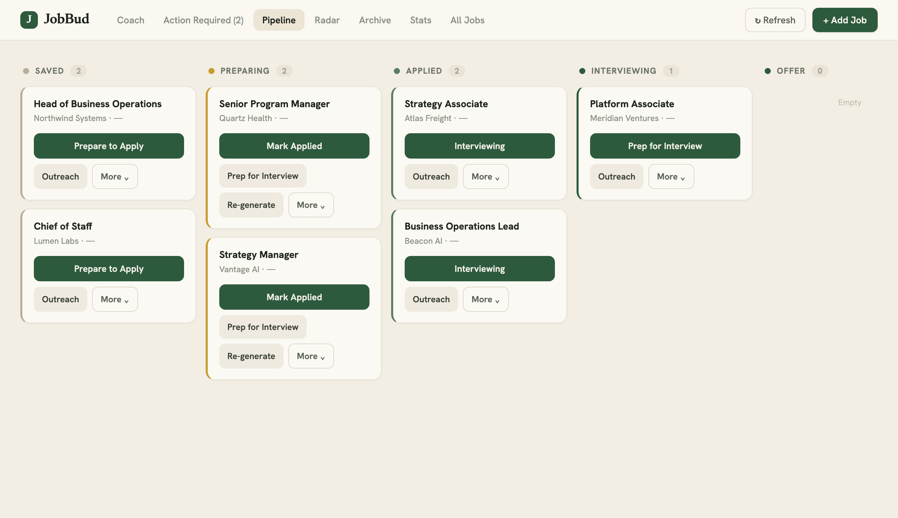

<div align="center">
  <h1>JobBud</h1>
  <p>A self-hosted, AI-powered job search dashboard for people who want their tools working for them.</p>

  [](https://github.com/nvparekh1294/jobbud/actions/workflows/ci.yml)
  [](LICENSE)
  [](https://vercel.com/new/clone?repository-url=https://github.com/nvparekh1294/jobbud&env=ANTHROPIC_API_KEY,GH_TOKEN,GH_REPO&envDescription=Required%20API%20keys%20for%20JobBud%20-%20see%20README%20for%20setup%20instructions&envLink=https://github.com/nvparekh1294/jobbud%23getting-started)
</div>

---



---

## Table of Contents

- [What JobBud is (and isn't)](#what-jobbud-is-and-isnt)
- [Features](#features)
- [How it works](#how-it-works)
- [Built With](#built-with)
- [Getting Started](#getting-started)
- [Optional Integrations](#optional-integrations)
- [LinkedIn Research](#linkedin-research--mutual-connection-lookup)
- [Known Limitations](#known-limitations)
- [Contributing](#contributing)
- [License](#license)

---

## What JobBud is (and isn't)

JobBud — your AI job search buddy — is a self-hosted job search pipeline. You deploy it to your own Vercel account. Your data lives in your own GitHub repo — keep it private. Job records, application status, and profile config are all stored there and should not be publicly visible. Nothing is shared, nothing is tracked, nothing is sold.

**JobBud is:**
- A personal dashboard for tracking jobs across the full application lifecycle
- An automated scanner that finds and scores job matches against your profile
- An AI-powered prep doc generator for applications and interviews
- A coaching library with context-aware job search advice

**JobBud is not:**
- A SaaS product — there is no hosted version, no account to create
- An agent that applies to jobs for you — every action requires your explicit approval
- A job board — it scans existing job boards, it is not one
- A recruiter replacement — it helps you prepare and track, not source opportunities
- Something that reads your email, calendar, or any data outside your GitHub repo

---

## Features

- **Pipeline kanban** — track jobs across Saved, Preparing, Applied, Interviewing, and Offer stages
- **AI job scoring** — every scanned job is evaluated against your profile for role fit, company fit, and compensation match
- **Application package generation** — AI-generated packages with tailored resume bullets, cover letter angles, and application Q&A
- **Interview prep** — role-specific question sets and answer frameworks drawn from your story bank, with a link back to previous rounds
- **Coach library** — on-demand coaching on resume writing, negotiation, outreach, and interview strategy
- **Automated scanning** — GitHub Actions cron job scans configured job boards on a schedule
- **Radar** — track target companies and get notified when relevant roles open
- **Outreach drafts** — AI-generated cold outreach and follow-up templates
- **Notifications** — daily and weekly summaries via email (SendGrid) or push (Telegram)

---

## How it works

JobBud runs across two systems. Both need to be configured for full functionality.

**Vercel** hosts the dashboard and API. This is where you view jobs, manage your pipeline, generate prep docs, and use the Coach.

**GitHub Actions** runs the job scanner on a cron schedule. The scanner searches configured job boards, scores matches against your profile, and writes results back to your GitHub repo, where the dashboard reads them.

```
[GitHub Actions]                    [Vercel]
Job scanner (cron)  ──────────────> Dashboard + API
Writes to repo                      Reads from repo
```

If you only deploy to Vercel, the dashboard will load but no jobs will be scanned. GitHub Actions and Vercel communicate through the same GitHub repo.

---

## Built With

- [Vercel](https://vercel.com) — serverless hosting and API
- [GitHub Actions](https://github.com/features/actions) — automated job scanning
- [Anthropic Claude API](https://www.anthropic.com) — job scoring, prep doc generation, and coaching
- [SendGrid](https://sendgrid.com) — email digests (optional)
- [Telegram Bot API](https://core.telegram.org/bots) — push notifications (optional)
- [Firecrawl](https://firecrawl.dev) — JS-rendered job portal scraping (optional)

---

## Getting Started

### Prerequisites

- A [GitHub account](https://github.com) with a personal access token that has `repo` scope
- A [Vercel account](https://vercel.com) (free Hobby plan works)
- An [Anthropic API key](https://console.anthropic.com)

### 1. Fork this repo

Click **Fork** at the top of this page. This creates your own copy at `your-username/jobbud`.

### 2. Deploy to Vercel

[](https://vercel.com/new/clone?repository-url=https://github.com/nvparekh1294/jobbud&env=ANTHROPIC_API_KEY,GH_TOKEN,GH_REPO&envDescription=Required%20API%20keys%20for%20JobBud%20-%20see%20README%20for%20setup%20instructions&envLink=https://github.com/nvparekh1294/jobbud%23getting-started)

During deploy, Vercel will prompt for three required environment variables:

| Variable | Description |
|----------|-------------|
| `ANTHROPIC_API_KEY` | Your Anthropic API key |
| `GH_TOKEN` | GitHub personal access token with `repo` scope |
| `GH_REPO` | Your GitHub repo in the format `username/jobbud` |

### 3. Configure your profile

Copy the example files and fill them in with your details. These files are gitignored and will never be committed.

```bash
cp config/profile.yml.example config/profile.yml
cp CLAUDE.md.example CLAUDE.md
cp story-bank.md.example story-bank.md
```

`config/profile.yml` is the most important — it tells the AI what roles to target and how to score matches. See the inline comments in the example file for guidance on each field.

### 4. Configure GitHub Actions

In your GitHub repo, go to **Settings → Secrets and variables → Actions** and add the same three variables:

- `ANTHROPIC_API_KEY`
- `GH_TOKEN`
- `GH_REPO`

The scanner runs automatically on a cron schedule once secrets are set. To trigger a manual scan, go to the **Actions** tab and trigger the workflow from there.

---

## Optional Integrations

All optional integrations fail silently when not configured. The dashboard works without any of them.

### Google Drive — automatic prep doc saving

Without it: application packages and prep docs are generated and available in a popup window to copy or reference. You can regenerate them anytime. With it: prep docs save automatically to a folder in your Google Drive, with a persistent link on the job card.

1. Create a project in [Google Cloud Console](https://console.cloud.google.com/) and enable the Google Docs and Drive APIs
2. Create OAuth 2.0 credentials and complete the auth flow to get a refresh token
3. Add `GOOGLE_CLIENT_ID`, `GOOGLE_CLIENT_SECRET`, and `GOOGLE_REFRESH_TOKEN` to your Vercel environment variables

> **Important:** Google OAuth apps start in "Testing" mode, where refresh tokens expire after 7 days. To prevent this, go to your OAuth consent screen in Google Cloud Console and click **Publish App** to switch to Production mode. Production mode tokens do not expire.

### SendGrid — email digests

Without it: check the dashboard manually or use Telegram for notifications. With it: daily and weekly email summaries of new job matches.

Add `SENDGRID_API_KEY`, `SENDGRID_FROM_EMAIL`, and `NOTIFICATION_EMAIL` to your Vercel environment variables.

### Telegram — push notifications

Without it: check the dashboard manually or use SendGrid for email digests. With it: push notifications for new matches and weekly digests via Telegram.

1. Create a bot via [@BotFather](https://t.me/botfather) and copy the token
2. Get your chat ID by messaging [@userinfobot](https://t.me/userinfobot)
3. Add `TELEGRAM_BOT_TOKEN` and `TELEGRAM_CHAT_ID` to your Vercel environment variables

### Firecrawl — company career pages

Without it: the scanner works for standard job boards and ATS platforms (Ashby, Greenhouse, Lever). Company-specific career pages that require JavaScript rendering — such as Meta, Microsoft, Google DeepMind, and similar custom portals — will be skipped.
With it: full support for JS-rendered company career pages.

Add `FIRECRAWL_API_KEY` to your Vercel environment variables.

### LinkedIn Research — mutual connection lookup

Without it: outreach drafts are generated without connection context. You can manually add notes about mutual connections in the job details and the AI will incorporate them into your outreach draft.
With it: the dashboard identifies mutual LinkedIn connections at target companies — first- and second-degree contacts including recruiters, hiring managers, peers, and investors — and incorporates that context directly into AI-generated outreach drafts. Knowing who you know at a company and how to reach them meaningfully increases your chances of getting a response and moving forward in the process.

> **Important:** This feature requires Claude Code with the chrome-devtools MCP installed locally on your machine. It automates browsing LinkedIn while you are logged in. This is subject to LinkedIn's Terms of Service — use at your own discretion and risk. The JobBud maintainers are not responsible for any account actions LinkedIn may take.

### Dashboard password

Without it: anyone with your Vercel URL can access the dashboard. With it: the dashboard is protected by a password gate.

Add `DASHBOARD_PASSWORD` to your Vercel environment variables.

---

## Known Limitations

### Vercel Hobby plan: 12 serverless function limit

JobBud uses 9 of the 12 serverless functions allowed on Vercel's free Hobby plan. Three slots remain. Adding new files to `api/` without removing an existing one will cause deployment to fail. If you need to extend the API, upgrade to a paid Vercel plan or consolidate existing functions first.

### GitHub job data file size

Job records are stored in `data/job-status.json` in your GitHub repo. The GitHub Contents API has a 1MB file limit. Users tracking a large number of jobs over many months may eventually hit this. If status updates stop saving, archive older job records to clear space.

---

## Contributing

Bug reports, feature requests, and pull requests are welcome.

To report a bug or request a feature, [open an issue](https://github.com/nvparekh1294/jobbud/issues).

To submit a PR, please read [CONTRIBUTING.md](CONTRIBUTING.md) first — it covers the repo constraints and what is currently in scope.

---

## License

Distributed under the MIT License. See [LICENSE](LICENSE) for details.
