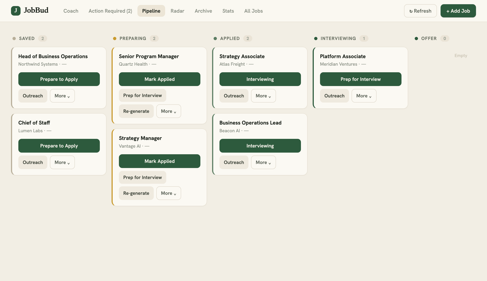

<div align="center">
  <h1>JobBud</h1>
  <p>A self-hosted, AI-powered job search dashboard for people who want their tools working for them.</p>

  [](https://github.com/nvparekh1294/jobbud/actions/workflows/ci.yml)
  [](LICENSE)
  [](https://vercel.com/new/clone?repository-url=https://github.com/nvparekh1294/jobbud&env=ANTHROPIC_API_KEY,GH_TOKEN,GH_REPO,DASHBOARD_PASSWORD&envDescription=Required%20API%20keys%20for%20JobBud%20-%20see%20README%20for%20setup%20instructions&envLink=https://github.com/nvparekh1294/jobbud%23getting-started)
</div>

---



---

## Table of Contents

- [What JobBud is (and isn't)](#what-jobbud-is-and-isnt)
- [Features](#features)
- [How it works](#how-it-works)
- [Built With](#built-with)
- [Getting Started](#getting-started)
- [Optional Integrations](#optional-integrations)
- [LinkedIn Research](#linkedin-research--mutual-connection-lookup)
- [Keeping your copy up to date](#keeping-your-copy-up-to-date)
- [Known Limitations](#known-limitations)
- [Contributing](#contributing)
- [License](#license)

---

## What JobBud is (and isn't)

JobBud — your AI job search buddy — is a self-hosted job search pipeline. You deploy it to your own Vercel account. Your data lives in your own GitHub repo — keep it private. Job records, application status, and profile config are all stored there and should not be publicly visible. Nothing is shared, nothing is tracked, nothing is sold.

**JobBud is:**
- A personal dashboard for tracking jobs across the full application lifecycle
- An automated scanner that finds and scores job matches against your profile
- An AI-powered prep doc generator for applications and interviews
- A coaching library with context-aware job search advice

**JobBud is not:**
- A SaaS product — there is no hosted version, no account to create
- An agent that applies to jobs for you — every action requires your explicit approval
- A job board — it scans existing job boards, it is not one
- A recruiter replacement — it helps you prepare and track, not source opportunities
- Something that reads your email, calendar, or any data outside your GitHub repo

---

## Features

- **Guided onboarding** — generate your profile files (`config/profile.yml`, `CLAUDE.md`, resume, bullet bank, background) from your resume and a few questions, then save them to your private repo or download them to review first
- **Profile-driven scoring** — every scanned job is evaluated against your `config/profile.yml` for role fit, company fit, and compensation match; change your profile and the scoring follows
- **Pipeline kanban** — track jobs across Saved, Preparing, Applied, Interviewing, and Offer stages
- **Bulk actions** — select multiple jobs in the All Jobs view and reject or change their status in one move
- **Application package generation** — AI-generated packages with tailored resume bullets, cover letter angles, and application Q&A
- **Interview prep** — role-specific question sets and answer frameworks drawn from your story bank, with a link back to previous rounds
- **Voice dictation** — answer mock-interview questions by speaking instead of typing (uses the browser Web Speech API; Chrome and Edge only)
- **Coach library** — on-demand coaching on resume writing, negotiation, outreach, and interview strategy
- **Persistent memory** — JobBud learns about you over time — your background and preferences, the writing voice you like, and your accomplishment stories with real numbers — and uses that context in every Coach conversation and every generated application. The **Memory** page ("What JobBud knows about you") is where you view, edit, and delete everything it has learned
- **Automated scanning** — GitHub Actions cron job scans configured job boards on a schedule. Scans score jobs synchronously by default, so each run finishes in a few minutes and uses only a small slice of your free Actions minutes. An optional batch mode (`USE_BATCH_API`) halves the Anthropic scoring cost but keeps a runner busy far longer per scan — see [What it costs to run](#what-it-costs-to-run) for the tradeoff
- **Radar** — track target companies and get notified when relevant roles open
- **Outreach drafts** — AI-generated cold outreach and follow-up templates
- **Notifications** — daily and weekly summaries via email (SendGrid) or push (Telegram)

---

## How it works

JobBud runs across two systems. Both need to be configured for full functionality.

**Vercel** hosts the dashboard and API. This is where you view jobs, manage your pipeline, generate prep docs, and use the Coach.

**GitHub Actions** runs the job scanner on a cron schedule. The scanner searches configured job boards, scores matches against your profile, and writes results back to your GitHub repo, where the dashboard reads them.

```
[GitHub Actions]                    [Vercel]
Job scanner (cron)  ──────────────> Dashboard + API
Writes to repo                      Reads from repo
```

If you only deploy to Vercel, the dashboard will load but no jobs will be scanned. GitHub Actions and Vercel communicate through the same GitHub repo.

### Memory

JobBud keeps what it learns about you in three plain markdown files in **your own** repo, under `data/memory/`: `profile.md` (durable facts), `voice.md` (writing-style rules), and `stories.md` (accomplishments with numbers). They are seeded from your resume and answers during onboarding, and updated afterward whenever you start a Coach message with "remember…" or click **Remember this** — a quick background pass on the cheap Haiku model distills the event into a bullet or two, merging rather than piling up duplicates. The whole store is capped at roughly 10,000 tokens.

On every Coach conversation and generated application, memory is prepended to the model's cached prompt prefix, so it costs very little to re-read each turn. Memory is loaded once when a conversation starts, which is why edits **apply to your next conversation**, not the one in progress.

Your memory lives **only** in your own private GitHub repo and is sent **only** to the Anthropic API — never to any third party. The Memory page is your full view/edit/delete surface. Because these files contain your real background, the same private-repo guard that protects your profile files applies to memory writes: if your repo is public, JobBud refuses to commit them.

---

## Built With

- [Vercel](https://vercel.com) — serverless hosting and API
- [GitHub Actions](https://github.com/features/actions) — automated job scanning
- [Anthropic Claude API](https://www.anthropic.com) — job scoring, prep doc generation, and coaching
- [SendGrid](https://sendgrid.com) — email digests (optional)
- [Telegram Bot API](https://core.telegram.org/bots) — push notifications (optional)
- [Firecrawl](https://firecrawl.dev) — JS-rendered job portal scraping (optional)

---

## Getting Started

### Prerequisites

- A [GitHub account](https://github.com) with a personal access token that has `repo` scope
- A [Vercel account](https://vercel.com) (free Hobby plan works)
- An [Anthropic API key](https://console.anthropic.com)

### What it costs to run

JobBud is built to run on free tiers, with one paid piece: the Anthropic API.

- **GitHub Actions** — free for the default setup. The daily scan scores jobs synchronously and finishes in about 6 minutes, which is well under GitHub's free 2,000 minutes/month for private repos. One thing to watch: those 2,000 minutes are shared across *all* your private repos, so if other private repos also run Actions, JobBud's usage counts against the same pool.
- **Anthropic API** — the one cost that isn't free. JobBud needs your own Anthropic API key, and this is **separate from a Claude.ai subscription** — Claude Pro and Claude Max do **not** include any API credits, so a subscription alone will not run JobBud. Expect roughly **$5–15/month** depending on how many jobs you scan; higher scan volume means more scoring calls and a higher bill. The optional `USE_BATCH_API` mode can halve this, at the cost of much longer Actions runs (see the note under Automated scanning above).
- **Vercel** — free. The dashboard and API fit within Vercel's free Hobby plan.
- **Persistent memory** — a small add-on to your Anthropic bill, roughly **$1–3/month** for an active user. Memory rides in the model's cached prompt prefix, so re-reading it each conversation is billed at about 10% of the normal input price, and each learning event (an onboarding seed, a "remember…", or a **Remember this** click) is around a cent on the cheaper Haiku model.

### 1. Deploy to Vercel

[](https://vercel.com/new/clone?repository-url=https://github.com/nvparekh1294/jobbud&env=ANTHROPIC_API_KEY,GH_TOKEN,GH_REPO,DASHBOARD_PASSWORD&envDescription=Required%20API%20keys%20for%20JobBud%20-%20see%20README%20for%20setup%20instructions&envLink=https://github.com/nvparekh1294/jobbud%23getting-started)

Clicking **Deploy** starts Vercel's clone flow: it creates your **own** copy of this repo in your GitHub account — **private by default** — and deploys that copy. Keep it private: your job data and personal profile files live inside it, and JobBud's "Save to my repo" refuses to write to a public repo. (Prefer to create the repo yourself, or already have one? See [Setting up without the deploy button](#setting-up-without-the-deploy-button) below.)

During deploy, Vercel will prompt for four required environment variables:

| Variable | Description |
|----------|-------------|
| `ANTHROPIC_API_KEY` | Your Anthropic API key |
| `GH_TOKEN` | GitHub personal access token with `repo` scope |
| `GH_REPO` | Your GitHub repo in the format `username/jobbud` |
| `DASHBOARD_PASSWORD` | Password gate for the dashboard. The dashboard fails closed — it will not serve your job data unless this is set, so choose a strong value. It is also the default signing key for the Apply/Reject buttons in your digest emails, so [step 3](#3-configure-github-actions--yes-the-same-keys-again) has you add the **same value** to GitHub Actions secrets — the scanner signs those links and the dashboard verifies them. |

> **Adding or editing a variable by hand? Two things to get right.** The Deploy button sets all of this up for you, but if you ever add or change a variable yourself in Vercel → **Settings → Environment Variables**:
>
> 1. **Tick "Production" for every variable.** Vercel lets you scope a variable to Production, Preview, and Development separately. Your live site reads **Production** only — a variable ticked for Development alone does nothing for it. (Ticking **Preview** as well is recommended.)
> 2. **Redeploy afterwards.** Variable changes do not reach a site that is already live. Go to **Deployments → ⋯ → Redeploy** on the latest deployment.
>
> **The symptom to watch for:** if your dashboard loads without ever asking for a password, but nothing actually works — uploads come back "Unauthorized", the chat stays silent — your variables are almost certainly missing from Production.

When the deploy finishes, your app lives at `https://<your-deployment>.vercel.app/dashboard` — that `/dashboard` at the end matters. If you open the bare root URL (`https://<your-deployment>.vercel.app` with nothing after it), Vercel shows a `404: NOT_FOUND` page. That is expected and does **not** mean your deploy failed — JobBud simply lives under `/dashboard`. Bookmark the `/dashboard` URL and use that.

### 2. Configure your profile

JobBud reads five personal files to score jobs and generate applications: `CLAUDE.md`, `cv.md`, `bullet-bank.md`, `article-digest.md`, and `config/profile.yml`. The easiest way to create them is the built-in onboarding — open your dashboard, go to the **Coach** tab, and follow **Onboarding**. It generates all five from your resume and a few short questions, then offers two ways to keep them:

- **Save to my repo** — JobBud commits the five files straight into your GitHub repo through the API. It does this **only if your repo is private**; a public repo is refused, because these files contain your real background.
- **Download** — review each file first, then add them yourself: `CLAUDE.md`, `cv.md`, `bullet-bank.md`, and `article-digest.md` at the repo root, `config/profile.yml` in `config/`. Commit all five.

Either way, these files live **in your private repo** — that is how the scanner (which runs from a fresh checkout in GitHub Actions) and the dashboard read them. The `.gitignore` lists them for a different reason: if you also work in a local clone, it stops you from hand-committing a second, stale copy — JobBud keeps the canonical versions in your repo for you. (This is also why your repo must be private: it holds these files.)

**Your company watch-list.** Onboarding also asks which companies you want JobBud to watch and builds a personalized `scanner/portals.yml` from their careers-page URLs — this **replaces** the example company list that ships with the repo, so your scans target *your* companies from day one instead of the maintainer's. You can **Skip** that step and set your companies later.

**Where the watch list lives, and how to change it any time.** The list is one file in your repo, `scanner/portals.yml`, and it is the only thing that decides which companies get checked on every scan. Three ways to edit it:

- **The dashboard — Radar tab → "⚙ Edit Watch List".** The everyday way, and the one to use if you skipped the onboarding step. It shows the companies currently being scanned, lets you add, edit, or remove them, works out each company's job board from its careers URL, and saves the whole list back to your repo. Saving **replaces** the list with exactly what's on screen. It also offers any company on your **Radar** that isn't being scanned yet as a one-click add — Radar and the watch list are two separate lists, and this is how you connect them.
- **Onboarding's companies step** (Coach tab → Onboarding), which builds the list from scratch as part of first-time setup.
- **Hand-editing `scanner/portals.yml`**, still the power-user path for tuning per-company keywords, marking stealth companies, or filling in Workday tenant/site details; see the comments at the top of that file.

If you never set your own list, every scan runs on the example companies and your digests say so, with one line at the top pointing you back here.

Prefer to start from templates instead of onboarding? Copy the examples and fill them in by hand:

```bash
cp config/profile.yml.example config/profile.yml
cp CLAUDE.md.example CLAUDE.md
cp story-bank.md.example story-bank.md
```

`config/profile.yml` is the one that matters most — it tells the scanner what roles to target and drives how every job is scored against your profile. See the inline comments in the example file for guidance on each field.

### 3. Configure GitHub Actions — yes, the same keys again

**This step is not optional, and it is the one people miss.** JobBud runs in two
places that cannot see each other's settings:

- the **dashboard**, which runs on Vercel and reads Vercel's environment variables, and
- the **scanner**, which runs on GitHub Actions and reads GitHub's repository secrets.

Setting a key in Vercel does **not** make it available to the scanner, and vice
versa. Each key you need in both places has to be entered **twice, under the same
name, in both settings screens.** Nothing warns you when only one is set — the
half that has the key works, the half that doesn't fails quietly.

In your GitHub repo, go to **Settings → Secrets and variables → Actions**, open
the **Secrets** tab, and click **New repository secret** for each of these:

| Secret name | Value | Why the scanner needs it |
|-------------|-------|--------------------------|
| `ANTHROPIC_API_KEY` | the same key you gave Vercel | Scoring every job it finds |
| `GH_TOKEN` | the same token you gave Vercel | Reading your profile files and committing results back |
| `DASHBOARD_PASSWORD` | **must match Vercel exactly** | Signs the Apply/Reject buttons in your digest emails — see below |
| `VERCEL_URL` | your deployment URL **including the scheme**, e.g. `https://your-app.vercel.app` | Builds the links in your emails. Without it they point at `localhost` and go nowhere |

You do **not** need to add `GH_REPO` here — GitHub Actions fills it in
automatically from the repo the workflow is running in.

Include the `https://` on `VERCEL_URL`. Some parts of the scanner use the value
exactly as you give it, so a bare `your-app.vercel.app` produces links with no
scheme — they look right in the email and go nowhere when clicked.

> **`DASHBOARD_PASSWORD` must be identical in both places, and here's why.**
> The Apply / Reject / Save buttons in your digest emails are signed links. The
> scanner (GitHub Actions) **signs** them; the dashboard (Vercel) **verifies**
> them — and both derive the signing key the same way: `ACTION_TOKEN_SECRET` if
> it is set, otherwise `DASHBOARD_PASSWORD` (`lib/auth.mjs`). So the two halves
> must arrive at the *same* key or no signature will ever match.
>
> **The symptom:** every button in every digest email fails, usually as an
> "invalid or expired link" — while the dashboard itself works perfectly. That
> means the two vaults disagree: `DASHBOARD_PASSWORD` is set in Vercel but
> missing from (or different in) GitHub Actions secrets.
>
> Setting a dedicated `ACTION_TOKEN_SECRET` is the cleaner option — it stops
> your dashboard password from doubling as a signing key. If you do, it has to
> be in **both** vaults too, with the same value. Setting it in only one place
> breaks the links in exactly the same way.

**Which symptom means which vault is missing the key:**

| What you see | What's missing |
|--------------|----------------|
| A scan run finishes but says the API key is not set, or it finds jobs and none of them ever get scored | `ANTHROPIC_API_KEY` is missing from **GitHub Actions secrets** |
| The dashboard's Coach chat stays silent, or onboarding never produces your files | `ANTHROPIC_API_KEY` is missing from **Vercel** environment variables (and check it's ticked for **Production**) |
| The dashboard works fine, but every Apply/Reject button in your emails fails as an invalid or expired link | The two vaults disagree on the signing key — `DASHBOARD_PASSWORD` (or `ACTION_TOKEN_SECRET`) differs between **Vercel** and **GitHub Actions secrets** |
| Email buttons point at `localhost` and go nowhere | `VERCEL_URL` is missing from **GitHub Actions secrets** |

The same two-places rule applies to every optional integration you add later —
Google Drive, SendGrid, Telegram, Firecrawl. [SETUP.md](SETUP.md) repeats it for
each one.

The scanner runs automatically on a cron schedule once secrets are set. To trigger a manual scan, go to the **Actions** tab and trigger the workflow from there — if a key is missing, that run's log is where it will say so.

That's it — you're set up. Open your dashboard at `https://<your-deployment>.vercel.app/dashboard` (remember the `/dashboard` — the bare root URL returns a Vercel `404: NOT_FOUND`, which is expected) and start with the **Coach** tab's onboarding if you haven't configured your profile yet.

### Setting up without the deploy button

The Deploy button above creates your private repo for you, so most people can skip this. Use it only if you'd rather create the repo yourself first, or you already have one you want to use.

Your copy must be **private** — JobBud stores your job data and personal profile files inside it. **Do not fork.** A fork of a public repo is itself public and cannot be made private, and JobBud's "Save to my repo" would then publish your personal data.

- **If a "Use this template" button appears** at the top of this repo: click it, choose **Create a new repository**, and set the visibility to **Private**.
- **Otherwise, duplicate it manually.** First create an empty **private** repo named `jobbud` under your account, then mirror this one into it:

  ```bash
  git clone --bare https://github.com/nvparekh1294/jobbud.git
  cd jobbud.git
  git push --mirror https://github.com/YOUR-USERNAME/jobbud.git
  ```

Then import your private `jobbud` repo into Vercel (Vercel dashboard → **Add New… → Project** → import the repo) and set the same four environment variables from step 1 — tick **Production** for each one, as described there. Continue with **Configure your profile** and **Configure GitHub Actions** above.

---

## Optional Integrations

All optional integrations fail silently when not configured. The dashboard works without any of them.

Every variable below is one you add by hand in Vercel → **Settings → Environment Variables**, so the same two rules from [Deploy to Vercel](#1-deploy-to-vercel) apply: tick **Production** (Development alone does nothing for your live site), then **redeploy** so the change takes effect.

**One exception:** the API job sources below are read by the scanner, not by the dashboard, so their keys go in **GitHub Actions secrets only** — the both-vaults rule does *not* apply to them.

### API job sources — jobs from across the web

Without them: JobBud only sees jobs on the companies in your watch list (`scanner/portals.yml`). With them: the weekly API scan also pulls listings from across the web — roles at companies you have never heard of, matched against the same profile and scored by the same pipeline. Each source is independent; set only the ones you have.

The four secret names are `JSEARCH_API_KEY`, `ADZUNA_APP_ID`, `ADZUNA_API_KEY`, and `SERP_API_KEY`, and they belong in your repo's **Settings → Secrets and variables → Actions** — *not* in Vercel, because only the GitHub Actions scanner reads them. Each service has its own signup and pricing, usually with a small free tier. The step-by-step walkthrough — which service is which, where to sign up, and how to tell a missing key from a misplaced one — is in **[SETUP.md](SETUP.md#optional-api-job-sources-jsearch-adzuna-serpapi)**.

### Google Drive — automatic prep doc saving

Without it: application packages and prep docs are generated and available in a popup window to copy or reference. You can regenerate them anytime. With it: prep docs save automatically to a folder in your Google Drive, with a persistent link on the job card.

This one needs a few steps — creating a Google Cloud project, enabling the Docs and Drive APIs, creating an OAuth client, and minting a refresh token with the included `get-google-token.mjs` helper. The full, followable walkthrough is in **[SETUP.md](SETUP.md#optional-auto-save-prep-docs-to-google-drive)**.

> **Important:** Google OAuth apps start in "Testing" mode, where refresh tokens expire after 7 days. To prevent this, go to your OAuth consent screen in Google Cloud Console and click **Publish App** to switch to Production mode. Production mode tokens do not expire.

### SendGrid — email digests

Without it: check the dashboard manually or use Telegram for notifications. With it: daily and weekly email summaries of new job matches.

Add `SENDGRID_API_KEY`, `SENDGRID_FROM_EMAIL`, and `NOTIFICATION_EMAIL` to your Vercel environment variables.

### Telegram — push notifications

Without it: check the dashboard manually or use SendGrid for email digests. With it: push notifications for new matches and weekly digests via Telegram.

1. Create a bot via [@BotFather](https://t.me/botfather) and copy the token
2. Get your chat ID by messaging [@userinfobot](https://t.me/userinfobot)
3. Add `TELEGRAM_BOT_TOKEN` and `TELEGRAM_CHAT_ID` to your Vercel environment variables

### Firecrawl — company career pages

Without it: the scanner works for standard job boards and ATS platforms (Ashby, Greenhouse, Lever). Company-specific career pages that require JavaScript rendering — such as Meta, Microsoft, Google DeepMind, and similar custom portals — will be skipped.
With it: full support for JS-rendered company career pages.

Add `FIRECRAWL_API_KEY` to your Vercel environment variables.

### LinkedIn Research — mutual connection lookup

Without it: outreach drafts are generated without connection context. You can manually add notes about mutual connections in the job details and the AI will incorporate them into your outreach draft.
With it: the dashboard identifies mutual LinkedIn connections at target companies — first- and second-degree contacts including recruiters, hiring managers, peers, and investors — and incorporates that context directly into AI-generated outreach drafts. Knowing who you know at a company and how to reach them meaningfully increases your chances of getting a response and moving forward in the process.

> **Important:** This feature requires Claude Code with the chrome-devtools MCP installed locally on your machine. It automates browsing LinkedIn while you are logged in. This is subject to LinkedIn's Terms of Service — use at your own discretion and risk. The JobBud maintainers are not responsible for any account actions LinkedIn may take.

### Dashboard password

`DASHBOARD_PASSWORD` is **required**, not optional — it is listed with the other required variables in [Deploy to Vercel](#1-deploy-to-vercel) above. The dashboard fails closed: without it set, the API returns 401 and serves no job data, so the dashboard cannot work. Set `DASHBOARD_PASSWORD` in your Vercel environment variables, ticked for **Production**, and use a strong value. If your dashboard opens with no password prompt at all, that variable is not reaching Production — see the note in [Deploy to Vercel](#1-deploy-to-vercel).

(The GitHub Actions scanner pipeline does not use this variable — it runs without it. Only the Vercel dashboard needs it.)

### What your deployment serves (and what it doesn't)

`DASHBOARD_PASSWORD` gates the **API** (job data, memory, generation), but it does **not** gate static files. By default Vercel uploads your whole repo, so any personal file you committed — `cv.md`, `config/profile.yml`, `CLAUDE.md`, `bullet-bank.md`, `story-bank.md`, `article-digest.md`, and the `data/*.json` the dashboard writes back — would have been fetchable at your deployment URL (e.g. `https://<your-deployment>.vercel.app/cv.md`) with no password. A `.vercelignore` now ships **only** the app code the functions and dashboard need at runtime, so those files are no longer uploaded to the deployment at all. Your personal files still live safely in your private GitHub repo, where the scanner and dashboard read them via the GitHub API. **If you deployed before this change, pull the update and redeploy** (a fresh deploy re-uploads with the new `.vercelignore`) so the previously exposed files are removed from your live deployment.

---

## Keeping your copy up to date

Your copy of JobBud is a **snapshot** — the state of this project at the moment you
made your private mirror. When bugs are fixed or features are added upstream, those
changes do **not** reach your copy automatically. You have to pull them in. There are
two ways to do that, and you only need one.

### The automatic path (recommended)

Your repo ships with a bundled update-check workflow (`.github/workflows/update-check.yml`).
Once a week it looks at the upstream JobBud repo, and if there are new commits it opens
a **pull request** in your own repo with those changes. You just review the PR and click
**Merge**. Nothing is applied until you approve it.

It needs one one-time setting to be allowed to open PRs for you. In your repo, go to
**Settings → Actions → General**, scroll to **Workflow permissions**, and enable
**"Allow GitHub Actions to create and approve pull requests."** Without this, the
workflow can't open the PR.

You don't have to wait for the weekly run — you can trigger a check anytime from the
**Actions** tab: pick **JobBud update check** and click **Run workflow**.

### The manual path

If you'd rather pull updates yourself — or the automatic PR ever runs into a conflict —
do it from a local clone.

**The first update needs some extra steps.** A copy made with the Deploy button starts
its own brand-new Git history, so Git has no idea the two repos are related and no
reference point for comparing them — and without a reference point it flags *every*
file that differs as a conflict, even files you've never opened. The fix is to tell Git
which upstream commit your copy was made from. Run these once, one line at a time:

```bash
# Point your clone at the upstream repo. Safe to re-run — if it is already set
# up, this does nothing.
git remote add upstream https://github.com/nvparekh1294/jobbud.git 2>/dev/null || true

# Get upstream's latest commits. Nothing on your machine changes yet.
git fetch upstream

# Find your repo's very first commit, and the exact snapshot of files it holds.
ROOT=$(git rev-list --max-parents=0 HEAD | tail -1)
TREE=$(git rev-parse $ROOT^{tree})

# Look through upstream's history for the commit holding that identical snapshot,
# and record it as your copy's starting point.
git replace --graft $ROOT $(git log --format='%H %T' upstream/main | awk -v t=$TREE '$2==t && !f {print $1; f=1}')

# Merge. Now that Git has a reference point, this behaves like any normal update.
git merge upstream/main
git push
```

You only do that once. The merge links the two histories for good, so from then on
updating is just:

```bash
git fetch upstream
git merge upstream/main
git push
```

If the `git replace` line fails with this:

```
error: new commit is the same as the old one: '<a long string of letters and numbers>'
```

then no upstream snapshot matches your starting point — usually because files were
changed before your copy's first commit. In that case run `git merge
--allow-unrelated-histories upstream/main` and expect to resolve a long list of
conflicts by hand:

- Anything under `api/`, `lib/`, `scanner/`, `dashboard/`, `.github/` — JobBud's own
  tool files. Keep **upstream's** version.
- Anything under `data/` or `config/` — your job data and your profile. Keep **your**
  version.
- Anything else at the top level (`README.md`, `SETUP.md`, `package.json`,
  `vercel.json`, and friends) — keep **upstream's** version, unless you deliberately
  customised the file.

### Will this clobber my data?

No. Your personal files — `config/profile.yml`, your profile/CV markdown, and
everything under `data/` — are yours, and upstream never changes them, so a merge
leaves them exactly as they are.

Conflicts are a separate thing from data loss, and there are two reasons you might see
one. The ordinary reason is that you edited JobBud's own tool files (code, workflows,
configuration) and upstream changed the same lines; Git flags those files and you
resolve them by hand before finishing the merge. If you never edited the tool code, you
won't hit this. The other reason is the missing starting point described above, which
makes Git report conflicts in files nobody edited — the `git replace --graft` step
prevents those, and the update-check workflow does the same thing for you
automatically.

### Breaking change: signed action links

If you deployed an earlier version of JobBud, note one breaking change: the action
links embedded in digest and reminder emails (the one-click "mark applied",
"reject", etc. buttons) are now signed with a hardened token scheme. **Action links
in emails sent before this release will no longer work** — clicking them is rejected
instead of changing a job's status. This affects only old emails already in your
inbox; every new email uses the new scheme. Manage those older jobs from the
dashboard instead. No configuration change is required, though setting a dedicated
`ACTION_TOKEN_SECRET` (see `.env.example`) is recommended.

---

## Known Limitations

### Vercel Hobby plan: 12 serverless function limit

JobBud uses 10 of the 12 serverless functions allowed on Vercel's free Hobby plan. Two slots remain. Adding new files to `api/` without removing an existing one will cause deployment to fail. If you need to extend the API, upgrade to a paid Vercel plan or consolidate existing functions first.

### GitHub job data file size

Job records are stored in `data/job-status.json` in your GitHub repo. The GitHub Contents API has a 1MB file limit. Users tracking a large number of jobs over many months may eventually hit this. If status updates stop saving, archive older job records to clear space.

---

## Contributing

Bug reports, feature requests, and pull requests are welcome.

To report a bug or request a feature, [open an issue](https://github.com/nvparekh1294/jobbud/issues).

To submit a PR, please read [CONTRIBUTING.md](CONTRIBUTING.md) first — it covers the repo constraints and what is currently in scope.

---

## License

Distributed under the MIT License. See [LICENSE](LICENSE) for details.
